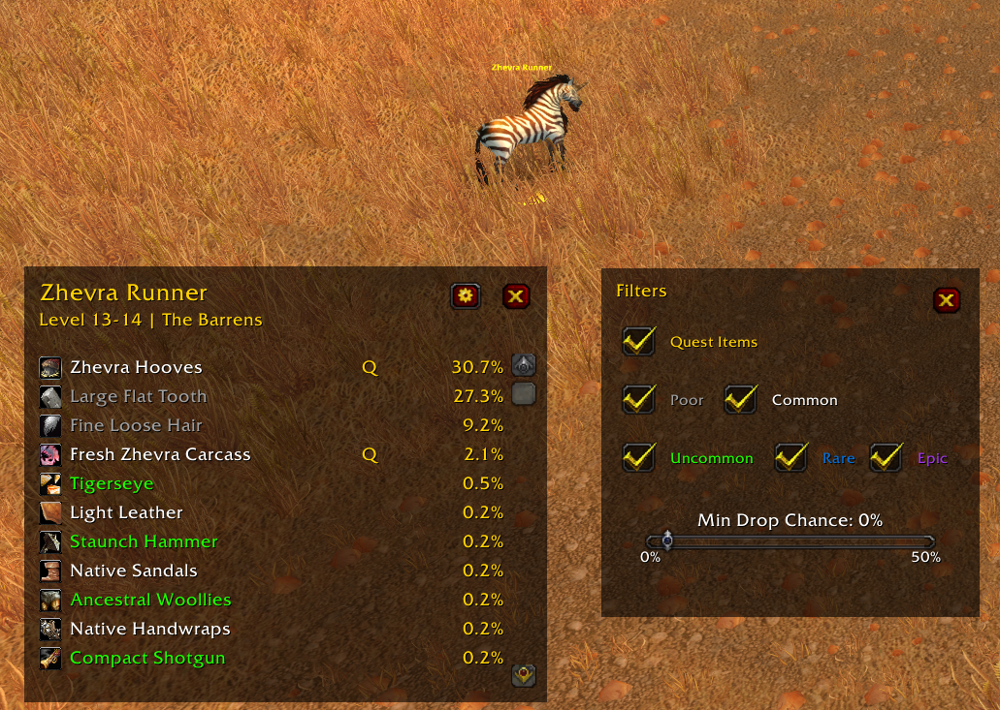
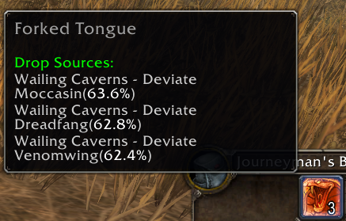

# LootTableExtreme

A World of Warcraft Classic addon that provides comprehensive loot table information for enemies and items.

**Supports both Classic Era (Vanilla) and TBC Classic!**

## Features

### 1. NPC Loot Table Viewer
- View complete loot tables for any npc in the game
- Filter by item quality (Poor, Common, Uncommon, Rare, Epic)
- Filter by minimum drop chance percentage
- Show/hide quest items separately
- View loot for your current target with one click
- **Resizable window** - Drag the resize handle in the bottom-right corner




### 2. Item Tooltip Enhancement
- Hover over any item in your bags to see the top 3 NPCs that drop it
- Shows npc level, zone and drop percentage
- Helps you quickly find where to farm specific items



### Planned Features
- Show vendor sources for items
- Show pickpocketing drop chances
- Search NPCs by name
- Search items by name


## Installation

### Classic Era (Vanilla)

1. Copy the `LootTableExtreme` folder to your WoW Classic Era addons directory:
   - Windows: `C:\Program Files (x86)\World of Warcraft\_classic_era_\Interface\AddOns\`
   - Mac: `/Applications/World of Warcraft/_classic_era_/Interface/AddOns/`

2. Restart WoW or reload your UI (`/reload`)

3. The addon will automatically load `LootTableExtreme.toc` for Vanilla Classic

### TBC Classic

1. Copy the `LootTableExtreme` folder to your WoW TBC Classic addons directory:
   - Windows: `C:\Program Files (x86)\World of Warcraft\_classic_\Interface\AddOns\`
   - Mac: `/Applications/World of Warcraft/_classic_/Interface/AddOns/`

2. Restart WoW or reload your UI (`/reload`)

3. The addon will automatically load `LootTableExtreme_TBC.toc` for TBC Classic

**Note:** The addon automatically detects which WoW client you're using and loads the appropriate loot database.

## Usage

### Commands

- `/lte` or `/loottable` - Toggle the loot table viewer window
- `/lte target` - Show loot table for your current target
- `/lte minimap` - Toggle minimap button visibility
- `/lte help` - Show command list

### Minimap Button

- **Left-click**: Open/close the loot table viewer
- **Right-click**: Show loot for your current target
- **Drag**: Reposition the button around the minimap

### Loot Table Viewer

The main window allows you to:

1. **Show target loot**: Click "Show Target" button or target an NPC and right-click the minimap button
2. **Filter items**: Use the checkboxes to show/hide specific item qualities
3. **Adjust minimum drop chance**: Use the slider to only show items above a certain drop percentage

### Default Filters

By default, the addon shows:
- Quest items (always visible when filter is on)
- Items with >0% drop chance
- Shows all item qualities

## Development

### Project Structure

```
LootTableExtreme/
├── LootTableExtreme.toc      # Addon manifest
├── Core.lua                  # Main addon initialization and commands
├── Database.lua              # Database core and query functions
├── LootDatabase.lua          # Auto-generated NPC loot data
├── VendorDatabase.lua        # Auto-generated vendor item data
├── PickpocketDatabase.lua    # Auto-generated pickpocket loot data
├── LootFrame.lua             # Loot table viewer UI and rendering
├── Filters.lua               # Item filtering logic
├── Settings.lua              # Settings UI and persistence
├── ModeManager.lua           # UI mode management (simple/advanced)
├── TargetHandler.lua         # Target detection and event handling
├── Tooltip.lua               # Item tooltip enhancement and minimap button
├── UI_simple.xml             # Main loot frame UI definition
├── UI_settings.xml           # Settings panel UI definition
├── install.ps1 / install.bat # Helper scripts to copy addon to WoW directory
├── docs/                     # Screenshots and documentation
└── tools/                    # Node.js scripts for scraping and data export
    ├── scraper.js            # Wowhead data scraper
    ├── exportLua.js          # Export database to Lua format
    ├── database.js           # SQLite database management
    └── README.md             # Tooling documentation
```

### Expanding the Database

The loot database is stored in `Database.lua` in the `DB.NpcLoot` table. Each NPC entry follows this structure:

```lua
["NPC Name"] = {
    npcId = 123,                    -- NPC ID (optional)
    level = {1, 5},                 -- Min and max level
    zone = "Zone Name",             -- Zone where npc is found
    elite = true,                   -- (optional) If npc is elite
    loot = {
        {
            itemId = 2589,          -- Item ID
            name = "Item Name",     -- Item name
            quality = DB.Quality.COMMON,  -- Quality (0-4)
            dropChance = 35.2,      -- Drop percentage
            isQuestItem = false,    -- Whether it's a quest item
        },
        -- More items...
    },
},
```

To add more NPCs and their loot:
1. Find the NPC loot data (from databases like ClassicDB, Wowhead Classic, etc.)
2. Add a new entry to the `DB.NpcLoot` table
3. Reload the UI to rebuild the item sources cache

### VSCode Extensions

The following extensions are recommended for development:

- **WoW Bundle** - Complete WoW addon development toolset
- **WoW API** - WoW API IntelliSense and documentation
- **Lua** - Lua language support
- **XML** - XML language support


## License

Free to use and modify for personal use.

## Credits

Created for WoW Classic (Vanilla) - Patch 1.15.0
